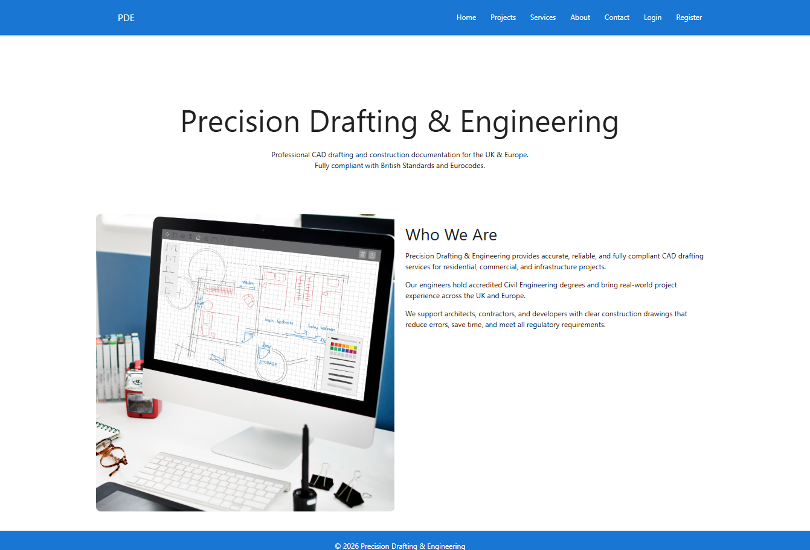

# Precision Drafting & Engineering Web Application
## (Robertas Sladkevicius)

---

## Live Webpage
https://flask-cad-app-f02f558dce17.herokuapp.com/

---

## Table of Content

1. Project Goals  
   i. User Goals  
   ii. Site Owner Goals  

2. User Experience  
   i. Target Audience  
   ii. User Requrements and Expectations  
   iii. User Stories  

3. Design  
   i. Design Choices  
   ii. Colour  
   iii. Fonts  
   iv. Structure  
   v. Wireframes  

4. Technologies Used  
   i. Languages  
   ii. Frameworks & Tools  

5. Features  

6. Testing  
   i. HTML Validation  
   ii. CSS Validation  
   iii. SendGrid
   iv. Accessibility  
   v. Performance  
   vi. Device Testing  
   vii. Browser Compatibility  
   viii. Testing User Stories  
   ix. Heroku
   x. Google Map API
   xi. Python

7. Bugs  

8. Deployment  

9. Credits  

10. Acknowledgements  

---

## 1. Project Goals

The goal of this project was to create a simple, efficient, and professional web-based application for managing CAD, engineering, and construction projects.  
The system allows users to upload orders, track progress, and communicate with administrators through a secure platform.

### i. User Goals
- Upload CAD and engineering project orders  
- Track order progress  
- Communicate with administrators  
- Receive updates and notifications  
- Use the application on desktop, tablet, and mobile  

### ii. Site Owner Goals
- Provide a professional project management platform  
- Manage users and orders through an admin panel  
- Ensure security and data protection  
- Deliver a responsive and reliable system  

---

## 2. User Experience

The application is designed with simplicity and usability in mind.  
Users can quickly understand how to use the platform without unnecessary complexity.

### i. Target Audience
- CAD engineers and draftspersons  
- Construction professionals  
- Clients submitting technical drawings  
- Small engineering companies  

### ii. User Requrements and Expectations
- Easy-to-use interface  
- Responsive design  
- Secure authentication  
- Accurate order tracking  
- Reliable contact and communication  

### iii. User Stories

**Site User**
- As a user, I want to upload orders easily  
- As a user, I want to track the progress of my orders  
- As a user, I want to communicate with the administrator  
- As a user, I want my data to be secure  
- As a user, I want to access the app on any device  

**Site Owner**
- As the site owner, I want to manage users and orders  
- As the site owner, I want to update order progress  
- As the site owner, I want secure role-based access  
- As the site owner, I want to receive contact messages  

---

### i. Design Choices
The application consists of multiple pages with specific purposes:

- **Home** – Short description of the app and welcome message  
- **Projects** – Portfolio showcase of projects  
- **Services** – Information about services offered  
- **About** – Details about the company and application purpose  
- **Contact** – Contact details, location, and a form for sending messages  
- **Login** – User or admin login page  
- **Register** – User registration page  
- **Logout** (hidden) – Appears only when a user is logged in, to log out securely  
- **User Dashboard** (hidden) – Visible only to logged-in users; users can:  
  - Upload orders (**Create**)  
  - View their orders and progress (**Read**)  
  - Edit or update their orders (**Update**)  
  - Delete their own orders (**Delete**)  
  - Send messages to the admin (**Create**)  
- **Admin Dashboard** (hidden) – Visible only to logged-in admins; admins can:  
  - Manage all users (**Create/Edit/Delete**)  
  - Manage all orders (**CRUD for all clients**)  
  - Track order progress for each client (**Read/Update**)  
  - Send messages to clients (**Create**)  

The design remains minimal and consistent across all pages, keeping focus on usability, clarity, and functionality.

### ii. Colour
A professional colour palette is used to maintain clarity and contrast.  
Primary colours are neutral and consistent across the site.

### iii. Fonts
Raleway font is used throughout the application for readability and clarity.

### iv. Structure
- Dashboard page: user orders and admin panel  
- Contact page: user feedback and communication  
- Fully responsive layout  

### v. Wireframes
Wireframes were created for:
- Desktop screens  
- Tablet screens  
- Mobile screens  

---

## 4. Technologies Used

### i. Languages
- HTML  
- CSS  
- Python  

### ii. Frameworks & Tools
- Flask  
- MongoDB (PyMongo)  
- Materialize CSS  
- SendGrid  
- Flask-Mail  
- Git & GitHub  
- Lucid  

---

## 5. Features

- User registration and login  
- Role-based access (admin/user)  
- Order upload and management  
- Progress tracking  
- Admin dashboard  
- Contact form  
- Email notifications  
- Responsive design  
- Secure password hashing  
- CRUD functionality  

---

## 6. Testing

### i. HTML Validation
All pages validated using W3C HTML Validator with no errors.

### ii. CSS Validation
CSS validated using W3C Jigsaw Validator with no errors.

### iii. SendGrid
Email functionality tested using SendGrid; all contact form emails were successfully delivered.

### iv. Accessibility
Accessibility tested using WAVE Web Accessibility tool to ensure all content is perceivable, operable, and understandable.

### v. Performance
Performance tested using Google Lighthouse; pages score high in performance, accessibility, best practices, and SEO.

### vi. Device Testing
Tested on multiple devices:
- Desktop  
- Tablet  
- Mobile devices  

### vii. Browser Compatibility
Tested on multiple browsers:
- Google Chrome  
- Microsoft Edge  
- Mozilla Firefox  
- Safari  

### viii. Testing User Stories
All user stories were tested and function as expected; both authenticated and guest users verified.

### ix. Heroku
Application successfully deployed on Heroku; tested with live database connection and static files served correctly.

### x. Google Map API
Embedded Google Maps tested on contact page; map loads correctly and markers display as expected.

### xi. Python
Python backend tested for all routes, database operations, and authentication; no errors found during execution.

## 7. Bugs

## 7. Bugs

| Bug | Fix |
|----|----|
| Order progress not updating | Fixed database update query |
| Email notifications failing | Correct SendGrid configuration |
| Mobile layout issues | Updated responsive CSS |
| Login validation errors | Improved input validation |
| Gunicorn installation changed behavior | Updated deployment configuration to work with Gunicorn |
| Responsiveness between 3x2 and 2x3 grids | Adjusted CSS to maintain proper layout transition between different screen widths |

---

## 8. Deployment

The project was deployed using Heroku.

Steps:
1. Clone the repository  
2. Set environment variables  
3. Push code to Heroku  
4. Launch application  

Live site:  
https://flask-cad-app-f02f558dce17.herokuapp.com/

---

## 9. Credits

- Flask documentation  
- MongoDB documentation  
- Materialize CSS  
- SendGrid documentation  

---

## 10. Acknowledgements

- Code Institute community  
- Mentors and tutors  
- Family support  

---

## Author

Robertas Sladkevicius  
Email: robertas.sladkevicius@gmail.com  
GitHub: github.com/Robertas-Cyberattack